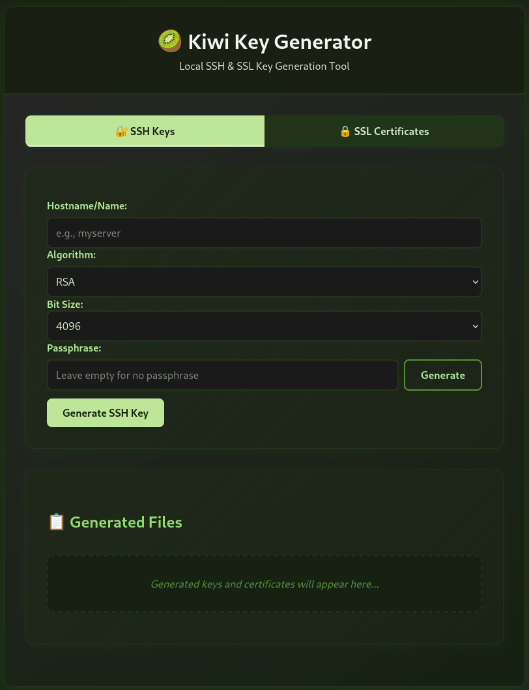

# 🥝 Kiwi Key Generator

> *Kiwi Key Generator is a browser-based tool for generating SSH keys and SSL certificates locally, without sending any data to external servers. It provides a clean, user-friendly interface for cryptographic operations that are typically performed via command line tools.*

<div align="center">




</div>

## 🚀 Live Demo

Try the live demo directly in your browser: [Kiwi Key Generator](https://derlocke-ng.github.io/kiwi-gen/)

## ✨ Features

### SSH Key Generation
- Generate RSA, Ed25519, and ECDSA keys
- Configurable key sizes (2048-bit, 4096-bit for RSA)
- Optional passphrase protection
- One-click download of private and public keys

### SSL Certificate Generation
- Create Certificate Authority (CA)
- Support for wildcard certificates (*.domain.com)
- DES3 encryption option for private keys
- Upload existing CA for certificate signing

## 🔧 Usage

### Option 1: Open directly in a browser
1. Clone or download this repository
2. Open `index.html` in any modern web browser
3. That's it! No installation or server required

### Option 2: Run with a local web server
If you prefer to use a local web server:
```bash
# Clone this repository
git clone https://github.com/derlocke-ng/kiwi-gen.git

# Navigate to the kiwi-gen directory
cd kiwi-gen

# Option A: Using Python's built-in HTTP server
python -m http.server 8000

# Option B: Using Python 3
python3 -m http.server 8000
```

Then open your browser and navigate to: `http://localhost:8000`

## 💻 How It Works

Kiwi Key Generator uses the [Forge](https://github.com/digitalbazaar/forge) JavaScript library to perform all cryptographic operations directly in your browser. Your keys and certificates never leave your device, ensuring maximum security.

### SSH Key Generation Process
1. Select the key type (RSA, Ed25519, or ECDSA)
2. Choose the bit size (for RSA and ECDSA)
3. Optionally add a passphrase for encryption
4. Click "Generate SSH Key"
5. Download your private and public keys

### SSL Certificate Generation Process
1. Create a Certificate Authority (CA) or upload an existing one
2. Download the CA key and certificate if necessary
3. Enter the domain name for your certificate
4. Click "Create Certificate"
5. Download your certificate and private key for your domain


## 🛠️ Development

Kiwi Key Generator is built with vanilla JavaScript, HTML, and CSS, with no build steps or complex dependencies. It uses the Forge.js library for cryptographic operations.

### Offline Usage

By default, the application uses forge.min.js from a CDN. For complete offline usage, you can download the library locally:

1. **Manual Method**:
   - Download forge.min.js from https://cdn.jsdelivr.net/npm/node-forge@1.3.1/dist/forge.min.js
   - Save it to your project directory
   - Update the script tag in index.html to use the local file:
     ```html
     <script src="forge.min.js"></script>
     ```

2. **Bash One-liner**:
   ```bash
   # Download forge.min.js and update index.html in one command
   curl -o forge.min.js https://cdn.jsdelivr.net/npm/node-forge@1.3.1/dist/forge.min.js && sed -i 's|https://cdn.jsdelivr.net/npm/node-forge@1.3.1/dist/forge.min.js|forge.min.js|g' index.html
   ```

