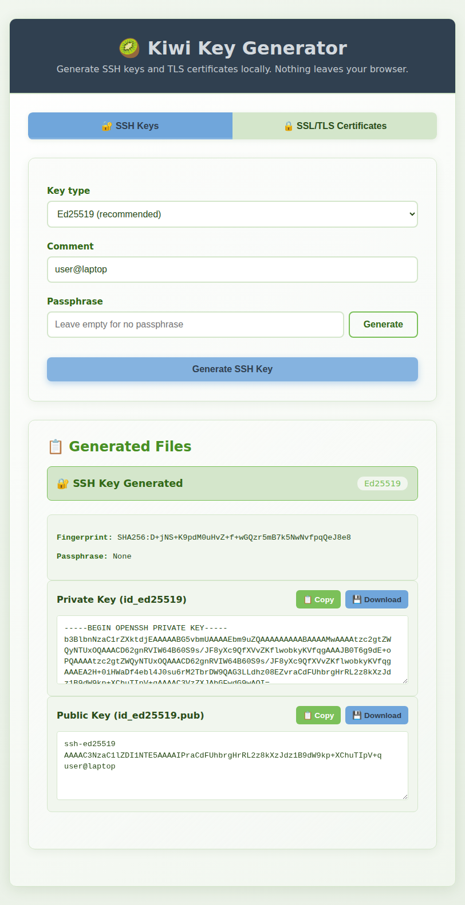

# 🥝 Kiwi Key Generator

> *Kiwi Key Generator is a browser-based manager for SSH keys, SSH certificates and TLS certificates. Everything is created and stored locally in an encrypted vault, and nothing is sent to any server.*

<div align="center">




</div>

## 🚀 Live Demo

Try the live demo directly in your browser: [Kiwi Key Generator](https://derlocke-ng.github.io/kiwi-gen/)

## ✨ Features

### Vault
- Keeps your keys and certificates in one encrypted vault (AES-256-GCM, key derived from your master password with PBKDF2-SHA256, 600,000 iterations)
- Stored encrypted in this browser's localStorage and decrypted only in memory while unlocked; export it as a file to back it up or move it to another device
- While unlocked, everything you create in the other tabs is saved automatically
- Add existing certificates, keys and SSH keys (a certificate with its key and chain becomes one item), or merge another vault file
- Rename items, add notes, delete, search, and see what expires soon
- Download any item in the format you need, with an optional passphrase (plus a `.p12` for certificates with keys); use stored CAs to sign new certificates

### SSH Keys
- Ed25519, ECDSA (P-256/384/521) and RSA (3072/4096)
- Real OpenSSH format (`id_ed25519` / `id_ed25519.pub`), accepted by `ssh`, `ssh-keygen` and `ssh-add`
- Optional passphrase, encrypted like `ssh-keygen` does (bcrypt KDF, aes256-ctr)
- SHA256 fingerprint shown for verification

### SSH Certificates
- Create an SSH CA, or load an existing CA key (OpenSSH or PEM, encrypted or not)
- Sign user certificates (log in as the listed accounts) or host certificates (no more "unknown host" prompts)
- Ready-made `sshd_config` and `known_hosts` lines to set up trust

### TLS Certificates
- Create a root CA, or an intermediate CA under it (ECDSA or RSA); CA keys can be encrypted (PKCS#8, AES-256)
- Or load an existing CA (PEM certificate, optionally with its chain, plus PKCS#8, PKCS#1, SEC1 or OpenSSH key)
- Issue server certificates for hostnames, wildcards and IP addresses, or client certificates for TLS client authentication
- Sign certificate requests (CSRs) from elsewhere, so the private key never has to come here
- Full chain file for servers when an intermediate signs, and `.p12` bundles for Windows, macOS, browsers and Java
- Certificates pass `openssl verify -x509_strict` and meet Apple's requirements for TLS server certificates

### Inspect & Convert
- Paste or open certificates, CSRs, private/public keys, SSH public keys and SSH certificates (PEM or DER) to see their details and fingerprints
- Checks whether a key matches a certificate, and whether a certificate was signed by another one in the same input
- Converts private keys between PKCS#8, PKCS#1 and OpenSSH, adding or removing a passphrase, and public keys between SSH and PEM

## 🔧 Usage

Open `index.html` in a modern browser (works straight from disk), or serve the folder:

```bash
git clone https://github.com/derlocke-ng/kiwi-gen.git
cd kiwi-gen
python3 -m http.server 8000
```

Then open `http://localhost:8000`. WebCrypto only works in secure contexts, so serving over plain HTTP from another machine won't work; use HTTPS, localhost or `file://`.

To use your TLS CA, import its certificate (`.pem`) into your OS or browser trust store, then configure your server with the certificate and key you generated (use the full chain file if an intermediate signed it).

A web page can't act as an SSH agent: browsers have no access to `SSH_AUTH_SOCK`. Load the keys and certificates you make here into your usual `ssh-agent` with `ssh-add`.

## 💻 How It Works

All cryptography uses the browser's built-in [Web Crypto API](https://developer.mozilla.org/docs/Web/API/Web_Crypto_API). The OpenSSH, X.509, PKCS#8, PKCS#10 and PKCS#12 encoding lives in `kiwi-crypto.js` (one file, no dependencies). There is no build step and nothing is loaded from a CDN. A Content-Security-Policy blocks all network requests, so keys can't leave the page. The vault is only as safe as your master password and your browser profile: use a strong password, and lock the vault when you're done.

Ed25519 needs a current browser (Chrome 137+, Firefox 129+, Safari 17+).
